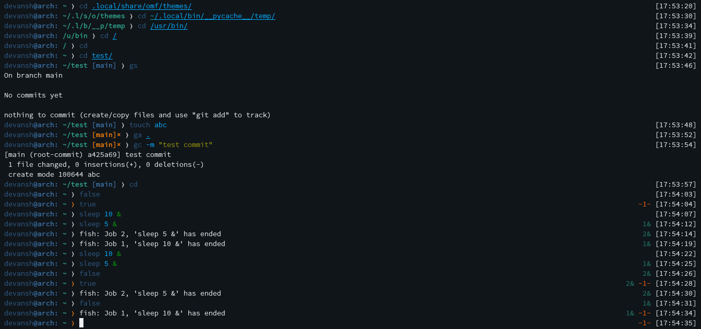

## simple fish theme

Clean git theme with homey feel and git-centric features.

#### Screenshot

#### Prompt structure:

* Left-hand side:
	* user@host:
	* short name cwd (first letter of each folder)
	* git branch with state info (if applicable)

* Right-hand side:
	* number of bg processes running (if any)
	* last error code (if applicable)
	* timestamp

#### Credits:

Forked from [godfather](https://github.com/oh-my-fish/theme-godfather) theme
